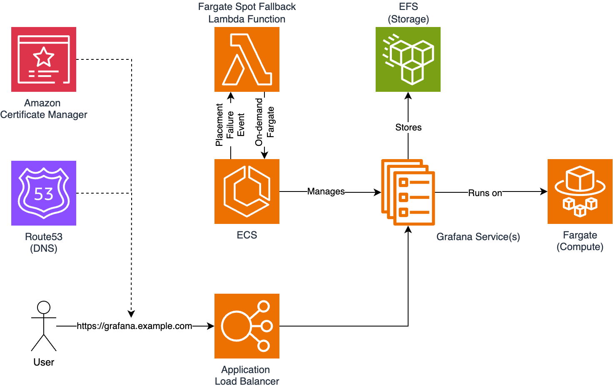

# Grafana on ECS Fargate

This Terraform module deploys Grafana on ECS Fargate (Spot) with EFS as storage, ALB (HTTPS) and user defined domain name.



## Credits

- Credits to [56kcloud](https://github.com/56kcloud/terraform-grafana) for the original idea of this module.
- Credits to [misterjoshua](https://github.com/wheatstalk/fargate-spot-fallback) for the fargate-spot-fallback Lambda function.

## Required

- The only resource that needs to be provided is a VPC with at least one public and private subnet. 

## Extra functionality

- This module is able to run Grafana on `FARGATE_SPOT` with fallback to `FARGATE (On-demand)`.
  - When `enable_spot = false` and `enable_fallback = false`, this module launches Grafana on `FARGATE`.
  - When `enable_spot = true` and `enable_fallback = false`, this module launches Grafana on `FARGATE_SPOT`.
  - When `enable_spot = true` and `enable_fallback = true`, this module launches two Grafana services (On-demand and Spot). When a 'placement failure' event is detected for `FARGATE_SPOT`, the `FARGATE` service sets the amount of `tasks` to `var.desired_number_of_tasks`.
- Grafana Image Renderer allows for rendering images of panels on any dashboard.
  - Currently using minimal resources, this could be insufficent when rendering multiple images in parralel. 

## Example

```terraform
module "grafana_ecs" {
  source = "git@github.com:dovetailworld/terraform-grafana-module.git?ref=<tag>"

  aws_region                     = "eu-west-1"
  domain                         = "grafana.example.com"
  grafana_root_url               = "https://grafana.example.com/"
  grafana_image                  = "grafana/grafana-oss"
  grafana_version                = "11.1.0"
  renderer_image                 = "grafana/grafana-image-renderer"
  renderer_version               = "3.11.1"
  cloudwatch_log_group_name      = "/ecs/grafana"
  cpu                            = 1024
  memory                         = 2048
  desired_number_of_tasks        = 1
  allow_inbound_from_cidr_blocks = ["0.0.0.0/0"]
  enable_spot                    = true
  enable_fallback                = true
  vpc_id                         = ""
  private_subnet_ids             = [""]
  public_subnet_ids              = [""]
}
```

## Test Lambda Function

You can test the Lambda function by using the below two JSON Events:

### SERVICE_TASK_PLACEMENT_FAILURE
```json
{
  "detail": {
    "eventName": "SERVICE_TASK_PLACEMENT_FAILURE"
  },
  "detail-type": "ECS Service Action",
  "resources": "arn:aws:ecs:eu-west-1:<account-id>:service/grafana/grafana-spot",
  "source": "aws.ecs"
}
```

### SERVICE_STEADY_STATE
```json
{
  "detail": {
    "eventName": "SERVICE_STEADY_STATE"
  },
  "detail-type": "ECS Service Action",
  "resources": "arn:aws:ecs:eu-west-1:<account-id>:service/grafana/grafana-spot",
  "source": "aws.ecs"
}
```

<!-- BEGIN_TF_DOCS -->
## Requirements

| Name | Version |
|------|---------|
| <a name="requirement_terraform"></a> [terraform](#requirement\_terraform) | >= 1.8 |
| <a name="requirement_archive"></a> [archive](#requirement\_archive) | ~> 2.0 |
| <a name="requirement_aws"></a> [aws](#requirement\_aws) | ~> 5.0 |

## Providers

| Name | Version |
|------|---------|
| <a name="provider_archive"></a> [archive](#provider\_archive) | ~> 2.0 |
| <a name="provider_aws"></a> [aws](#provider\_aws) | ~> 5.0 |

## Modules

No modules.

## Resources

| Name | Type |
|------|------|
| [aws_acm_certificate.this](https://registry.terraform.io/providers/hashicorp/aws/latest/docs/resources/acm_certificate) | resource |
| [aws_cloudwatch_event_rule.this](https://registry.terraform.io/providers/hashicorp/aws/latest/docs/resources/cloudwatch_event_rule) | resource |
| [aws_cloudwatch_event_target.this](https://registry.terraform.io/providers/hashicorp/aws/latest/docs/resources/cloudwatch_event_target) | resource |
| [aws_cloudwatch_log_group.this](https://registry.terraform.io/providers/hashicorp/aws/latest/docs/resources/cloudwatch_log_group) | resource |
| [aws_ecs_cluster.this](https://registry.terraform.io/providers/hashicorp/aws/latest/docs/resources/ecs_cluster) | resource |
| [aws_ecs_service.fargate_ondemand](https://registry.terraform.io/providers/hashicorp/aws/latest/docs/resources/ecs_service) | resource |
| [aws_ecs_service.fargate_spot](https://registry.terraform.io/providers/hashicorp/aws/latest/docs/resources/ecs_service) | resource |
| [aws_ecs_task_definition.this](https://registry.terraform.io/providers/hashicorp/aws/latest/docs/resources/ecs_task_definition) | resource |
| [aws_efs_access_point.this](https://registry.terraform.io/providers/hashicorp/aws/latest/docs/resources/efs_access_point) | resource |
| [aws_efs_file_system.this](https://registry.terraform.io/providers/hashicorp/aws/latest/docs/resources/efs_file_system) | resource |
| [aws_efs_mount_target.this](https://registry.terraform.io/providers/hashicorp/aws/latest/docs/resources/efs_mount_target) | resource |
| [aws_iam_policy.ecs_task_custom_policy](https://registry.terraform.io/providers/hashicorp/aws/latest/docs/resources/iam_policy) | resource |
| [aws_iam_policy.fargate_spot_fallback_policy](https://registry.terraform.io/providers/hashicorp/aws/latest/docs/resources/iam_policy) | resource |
| [aws_iam_role.ecs_task_execution_role](https://registry.terraform.io/providers/hashicorp/aws/latest/docs/resources/iam_role) | resource |
| [aws_iam_role.ecs_task_role](https://registry.terraform.io/providers/hashicorp/aws/latest/docs/resources/iam_role) | resource |
| [aws_iam_role.fargate_spot_fallback_role](https://registry.terraform.io/providers/hashicorp/aws/latest/docs/resources/iam_role) | resource |
| [aws_iam_role_policy_attachment.fargate_spot_fallback_policy_attach](https://registry.terraform.io/providers/hashicorp/aws/latest/docs/resources/iam_role_policy_attachment) | resource |
| [aws_iam_role_policy_attachment.task_cloudwatch](https://registry.terraform.io/providers/hashicorp/aws/latest/docs/resources/iam_role_policy_attachment) | resource |
| [aws_iam_role_policy_attachment.task_custom](https://registry.terraform.io/providers/hashicorp/aws/latest/docs/resources/iam_role_policy_attachment) | resource |
| [aws_iam_role_policy_attachment.task_ecr](https://registry.terraform.io/providers/hashicorp/aws/latest/docs/resources/iam_role_policy_attachment) | resource |
| [aws_iam_role_policy_attachment.task_execution_cloudwatch](https://registry.terraform.io/providers/hashicorp/aws/latest/docs/resources/iam_role_policy_attachment) | resource |
| [aws_iam_role_policy_attachment.task_execution_custom](https://registry.terraform.io/providers/hashicorp/aws/latest/docs/resources/iam_role_policy_attachment) | resource |
| [aws_iam_role_policy_attachment.task_execution_ecr](https://registry.terraform.io/providers/hashicorp/aws/latest/docs/resources/iam_role_policy_attachment) | resource |
| [aws_iam_role_policy_attachment.task_execution_ssm_ro](https://registry.terraform.io/providers/hashicorp/aws/latest/docs/resources/iam_role_policy_attachment) | resource |
| [aws_iam_role_policy_attachment.task_ssm_ro](https://registry.terraform.io/providers/hashicorp/aws/latest/docs/resources/iam_role_policy_attachment) | resource |
| [aws_lambda_function.fargate_spot_fallback](https://registry.terraform.io/providers/hashicorp/aws/latest/docs/resources/lambda_function) | resource |
| [aws_lb.this](https://registry.terraform.io/providers/hashicorp/aws/latest/docs/resources/lb) | resource |
| [aws_lb_listener.http](https://registry.terraform.io/providers/hashicorp/aws/latest/docs/resources/lb_listener) | resource |
| [aws_lb_listener.https](https://registry.terraform.io/providers/hashicorp/aws/latest/docs/resources/lb_listener) | resource |
| [aws_lb_target_group.this](https://registry.terraform.io/providers/hashicorp/aws/latest/docs/resources/lb_target_group) | resource |
| [aws_route53_record.this](https://registry.terraform.io/providers/hashicorp/aws/latest/docs/resources/route53_record) | resource |
| [aws_route53_zone.this](https://registry.terraform.io/providers/hashicorp/aws/latest/docs/resources/route53_zone) | resource |
| [aws_security_group.alb_sg](https://registry.terraform.io/providers/hashicorp/aws/latest/docs/resources/security_group) | resource |
| [aws_security_group.ecs_service_sg](https://registry.terraform.io/providers/hashicorp/aws/latest/docs/resources/security_group) | resource |
| [aws_security_group.efs_sg](https://registry.terraform.io/providers/hashicorp/aws/latest/docs/resources/security_group) | resource |
| [archive_file.fargate_spot_fallback_lambda](https://registry.terraform.io/providers/hashicorp/archive/latest/docs/data-sources/file) | data source |
| [aws_caller_identity.current](https://registry.terraform.io/providers/hashicorp/aws/latest/docs/data-sources/caller_identity) | data source |
| [aws_iam_policy_document.fargate_spot_fallback_assume_role](https://registry.terraform.io/providers/hashicorp/aws/latest/docs/data-sources/iam_policy_document) | data source |
| [aws_iam_policy_document.fargate_spot_fallback_policy](https://registry.terraform.io/providers/hashicorp/aws/latest/docs/data-sources/iam_policy_document) | data source |
| [aws_iam_policy_document.this](https://registry.terraform.io/providers/hashicorp/aws/latest/docs/data-sources/iam_policy_document) | data source |

## Inputs

| Name | Description | Type | Default | Required |
|------|-------------|------|---------|:--------:|
| <a name="input_alb_target_group_deregistration_delay"></a> [alb\_target\_group\_deregistration\_delay](#input\_alb\_target\_group\_deregistration\_delay) | The amount time for Elastic Load Balancing to wait before changing the state of a deregistering target from draining to unused. The range is 0-3600 seconds. | `number` | `15` | no |
| <a name="input_alb_target_group_protocol"></a> [alb\_target\_group\_protocol](#input\_alb\_target\_group\_protocol) | The network protocol to use for routing traffic from the ALB to the Targets. Must be one of HTTP or HTTPS. Note that if HTTPS is used, per https://goo.gl/NiOVx7, the ALB will use the security settings from ELBSecurityPolicy2015-05. | `string` | `"HTTP"` | no |
| <a name="input_allow_inbound_from_cidr_blocks"></a> [allow\_inbound\_from\_cidr\_blocks](#input\_allow\_inbound\_from\_cidr\_blocks) | A list of IP CIDR blocks allowed to access Grafana via the lb. | `list(any)` | <pre>[<br>  "0.0.0.0/0"<br>]</pre> | no |
| <a name="input_assign_public_ip"></a> [assign\_public\_ip](#input\_assign\_public\_ip) | Assign a public IP address to the ENI (Fargate launch type only). | `bool` | `false` | no |
| <a name="input_aws_region"></a> [aws\_region](#input\_aws\_region) | The AWS region in which the ECS Service will be created. | `string` | n/a | yes |
| <a name="input_cloudwatch_log_group_name"></a> [cloudwatch\_log\_group\_name](#input\_cloudwatch\_log\_group\_name) | The name of the Cloudwatch log group where Grafana will send logs to. | `string` | `"/ecs/grafana"` | no |
| <a name="input_cpu"></a> [cpu](#input\_cpu) | The number of CPU units to allocate to the Grafana ECS Service. | `number` | `1024` | no |
| <a name="input_deployment_maximum_percent"></a> [deployment\_maximum\_percent](#input\_deployment\_maximum\_percent) | The upper limit, as a percentage of var.desired\_number\_of\_tasks, of the number of running ECS Tasks that can be running in a service during a deployment. Setting this to more than 100 means that during deployment, ECS will deploy new instances of a Task before undeploying the old ones. | `number` | `200` | no |
| <a name="input_deployment_minimum_healthy_percent"></a> [deployment\_minimum\_healthy\_percent](#input\_deployment\_minimum\_healthy\_percent) | The lower limit, as a percentage of var.desired\_number\_of\_tasks, of the number of running ECS Tasks that must remain running and healthy in a service during a deployment. Setting this to less than 100 means that during deployment, ECS may undeploy old instances of a Task before deploying new ones. | `number` | `100` | no |
| <a name="input_desired_number_of_tasks"></a> [desired\_number\_of\_tasks](#input\_desired\_number\_of\_tasks) | How many instances of the Grafana ECS Service to run across the ECS cluster. | `number` | `1` | no |
| <a name="input_domain"></a> [domain](#input\_domain) | The root domain to use for Route53 and ACM. | `string` | n/a | yes |
| <a name="input_enable_fallback"></a> [enable\_fallback](#input\_enable\_fallback) | Enable to create an additional service that uses FARGATE (On-demand) in case FARGATE\_SPOT is unavailable. | `bool` | `false` | no |
| <a name="input_enable_spot"></a> [enable\_spot](#input\_enable\_spot) | Enable to use FARGATE\_SPOT instead of FARGATE (On-demand). | `bool` | `false` | no |
| <a name="input_grafana_container_port"></a> [grafana\_container\_port](#input\_grafana\_container\_port) | The port number on which the Grafana container accepts incoming HTTP or HTTPS traffic. | `number` | `3000` | no |
| <a name="input_grafana_image"></a> [grafana\_image](#input\_grafana\_image) | The Docker image for Grafana to run. | `string` | `"grafana/grafana-oss"` | no |
| <a name="input_grafana_root_url"></a> [grafana\_root\_url](#input\_grafana\_root\_url) | The root URL for Grafana, if not set it might cause issues with OAuth. | `string` | `"%(protocol)s://%(domain)s:%(http_port)s/"` | no |
| <a name="input_grafana_version"></a> [grafana\_version](#input\_grafana\_version) | Which version (AKA tag) of the var.grafana\_image to deploy. | `string` | `"11.1.0"` | no |
| <a name="input_health_check_grace_period_seconds"></a> [health\_check\_grace\_period\_seconds](#input\_health\_check\_grace\_period\_seconds) | Seconds to ignore failing load balancer health checks on newly instantiated tasks to prevent premature shutdown, up to 1800. Only valid for services configured to use load balancers. | `number` | `15` | no |
| <a name="input_health_check_healthy_threshold"></a> [health\_check\_healthy\_threshold](#input\_health\_check\_healthy\_threshold) | The number of consecutive successful health checks required before considering an unhealthy Target healthy. The acceptable range is 2 to 10. | `number` | `5` | no |
| <a name="input_health_check_interval"></a> [health\_check\_interval](#input\_health\_check\_interval) | The approximate amount of time, in seconds, between health checks of an individual Target. Minimum value 5 seconds, Maximum value 300 seconds. | `number` | `30` | no |
| <a name="input_health_check_matcher"></a> [health\_check\_matcher](#input\_health\_check\_matcher) | The HTTP codes to use when checking for a successful response from a Target. You can specify multiple values (e.g. '200,202') or a range of values (e.g. '200-299'). | `string` | `"200"` | no |
| <a name="input_health_check_path"></a> [health\_check\_path](#input\_health\_check\_path) | Destination for the health check request. Required for HTTP/HTTPS ALB and HTTP NLB. Only applies to HTTP/HTTPS. | `string` | `"/login"` | no |
| <a name="input_health_check_protocol"></a> [health\_check\_protocol](#input\_health\_check\_protocol) | The protocol the ALB uses when performing health checks on Targets. Must be one of HTTP and HTTPS. | `string` | `"HTTP"` | no |
| <a name="input_health_check_timeout"></a> [health\_check\_timeout](#input\_health\_check\_timeout) | The amount of time, in seconds, during which no response from a Target means a failed health check. The acceptable range is 2 to 60 seconds. | `number` | `5` | no |
| <a name="input_health_check_unhealthy_threshold"></a> [health\_check\_unhealthy\_threshold](#input\_health\_check\_unhealthy\_threshold) | The number of consecutive failed health checks required before considering a target unhealthy. The acceptable range is 2 to 10. | `number` | `2` | no |
| <a name="input_memory"></a> [memory](#input\_memory) | How much memory, in MB, to give the Grafana ECS Service. | `number` | `2048` | no |
| <a name="input_platform_version"></a> [platform\_version](#input\_platform\_version) | The ECS Fargate version to run Grafana on. | `string` | `"LATEST"` | no |
| <a name="input_private_subnet_ids"></a> [private\_subnet\_ids](#input\_private\_subnet\_ids) | The list of private subnet IDs. | `list(any)` | n/a | yes |
| <a name="input_public_subnet_ids"></a> [public\_subnet\_ids](#input\_public\_subnet\_ids) | The list of public subnet IDs. | `list(any)` | n/a | yes |
| <a name="input_renderer_image"></a> [renderer\_image](#input\_renderer\_image) | The Docker image for Renderer to run. | `string` | `"grafana/grafana-image-renderer"` | no |
| <a name="input_renderer_version"></a> [renderer\_version](#input\_renderer\_version) | Which version (AKA tag) of the var.renderer\_image to deploy. | `string` | `"3.11.1"` | no |
| <a name="input_service_name"></a> [service\_name](#input\_service\_name) | The name of the Grafana ECS service. | `string` | `"grafana"` | no |
| <a name="input_vpc_id"></a> [vpc\_id](#input\_vpc\_id) | The VPC ID in which to deploy the resources. | `string` | n/a | yes |

## Outputs

| Name | Description |
|------|-------------|
| <a name="output_efs_arn"></a> [efs\_arn](#output\_efs\_arn) | Output EFS ARN |
| <a name="output_efs_id"></a> [efs\_id](#output\_efs\_id) | Output EFS ID |
| <a name="output_efs_name"></a> [efs\_name](#output\_efs\_name) | Output EFS Name |
<!-- END_TF_DOCS -->
